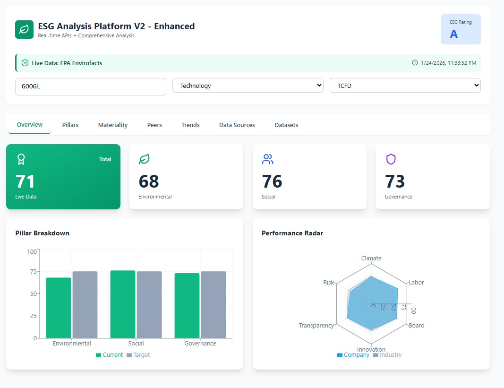
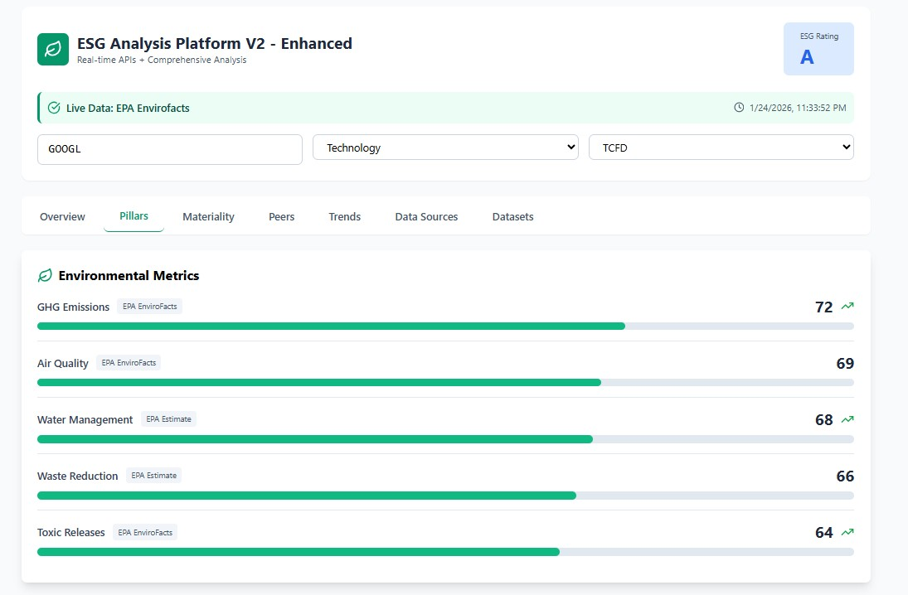
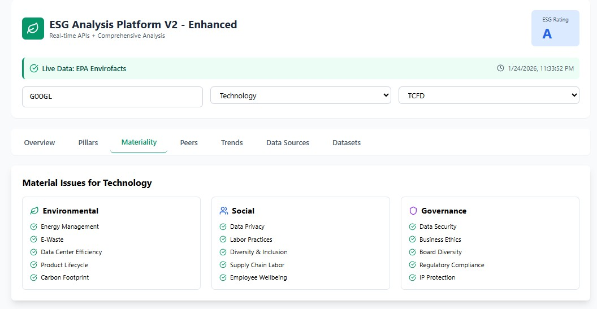
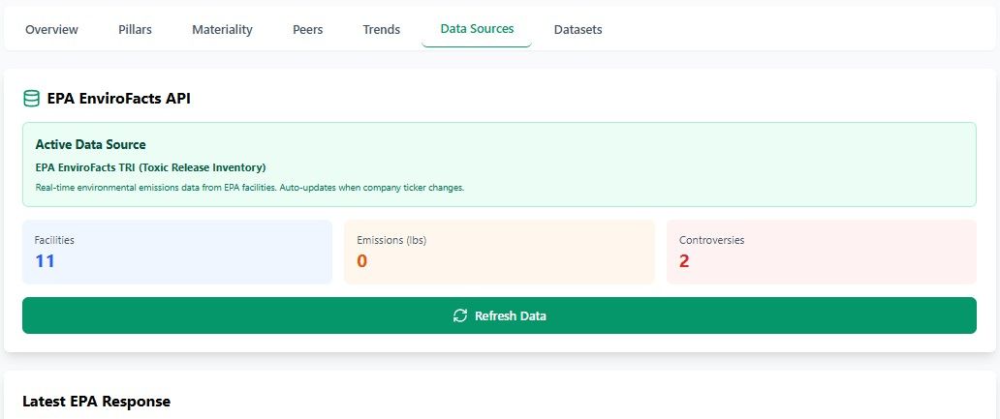

# 🌱 ESG Analysis Platform V2 — Enhanced

An interactive **Environmental, Social & Governance (ESG)** analytics platform that combines **real-time environmental data**, **industry-aware scoring**, and **transparent assumptions** to produce credible ESG insights.

Built with **React**, powered by **EPA EnviroFacts**, and designed to demonstrate how modern ESG platforms actually work under real-world data constraints.

---

## 🚀 What This Platform Does

This platform allows you to:

* 🔍 Search any public company by **ticker** (e.g. `AAPL`, `TSLA`, `NVDA`)
* 🌍 Pull **real environmental emissions data** from the **EPA EnviroFacts TRI API**
* 📊 Calculate **Environmental, Social, and Governance scores** using weighted frameworks
* 🧠 Transparently fall back to **estimated ESG scores** when real-world data is unavailable
* 📈 Visualise ESG performance using charts, radar plots, and trends

It is **not a toy ESG score generator** — it reflects the *messy reality* of ESG data.

---

## 🖼️ Platform Walkthrough

### 🔹 Overview Dashboard



* **Total ESG Score** (framework-weighted)
* Individual **E / S / G pillar scores**
* ESG **rating bands** (AAA → CCC)
* Live data status and last refresh timestamp

---

### 🔹 Environmental Metrics (Live EPA Data)



* GHG Emissions
* Air Quality
* Water Management
* Waste Reduction
* Toxic Releases

Each metric is derived from:

* 🟢 **EPA TRI facility data** when available
* 🟡 **Industry-calibrated estimates** when not

> ⚠️ Important: Many technology companies (e.g. NVIDIA, META) **legitimately have no TRI facilities**. The platform handles this correctly.

---

### 🔹 Social & Governance Metrics



These pillars use:

* Industry benchmarks
* Controlled randomness (to avoid flat scores)
* Weight-based aggregation

This reflects how many commercial ESG providers model **non-physical risk factors**.

---

### 🔹 Data Sources Transparency



You can always see:

* Number of EPA facilities found
* Total reported emissions
* Whether scores are **EPA-backed or estimated**

No black boxes.

---

## 🧠 How ESG Scoring Works (Important)

### 1️⃣ Environmental (E)

Environmental scores are calculated using:

* **EPA EnviroFacts TRI data** (when available)
* Emissions banding (not naive linear scaling)
* Facility-count penalties (log-scaled, non-saturating)
* Industry-based calibration

This avoids common ESG mistakes such as:

* ❌ Everyone scoring 95+
* ❌ Tech companies being treated like oil majors
* ❌ Penalising companies for missing data

---

### 2️⃣ Social (S)

Social metrics are estimated using:

* Industry baselines
* Weighted sub-metrics (labour, diversity, community, human rights)
* Controlled variance to avoid identical scores

---

### 3️⃣ Governance (G)

Governance scoring focuses on:

* Board independence
* Ethics & transparency
* Shareholder rights
* Executive compensation alignment

Governance scores tend to be **more stable**, which is realistic.

---

## 📐 ESG Frameworks Supported

The platform supports multiple ESG frameworks, each with different weightings:

| Framework | Environmental | Social | Governance |
| --------- | ------------- | ------ | ---------- |
| GRI       | 33%           | 33%    | 34%        |
| SASB      | 30%           | 35%    | 35%        |
| TCFD      | 50%           | 20%    | 30%        |
| CDP       | 60%           | 15%    | 25%        |

Switching frameworks **recalculates the total ESG score in real time**.

---

## 🔑 API Usage (Very Important)

### 🌍 EPA EnviroFacts TRI API

This platform uses the **EPA EnviroFacts Toxic Release Inventory (TRI) API**.

**Key characteristics:**

* ✅ Public API (no API key required)
* ❌ Not ticker-based
* ❌ Not company-friendly
* ✅ Facility-based and regulation-grade

Example endpoint used:

```
https://data.epa.gov/efservice/tri_facility/PRIMARY_NAME/APPLE%20INC/rows/0:50/JSON
```

### Why this matters

* Many companies **do not report TRI data**
* Missing data ≠ bad performance
* ESG systems must handle this gracefully

This platform does exactly that.

---

## 🧪 Why Scores Sometimes Don’t Change Much

This is **intentional and correct**.

If two companies:

* Are in the same industry
* Have no EPA TRI facilities

Then their **Environmental scores should be similar**, not artificially different.

This reflects real ESG modelling practice.

---

## 🛠️ Tech Stack

* **React** (Frontend)
* **Recharts** (Data visualisation)
* **Lucide Icons**
* **EPA EnviroFacts API**
* Tailwind CSS

---

## 🎯 Who This Project Is For

* ESG / Sustainability analysts
* Product & data science portfolios
* Consulting case studies
* Demonstrating *real-world data reasoning*

This is **not** a greenwashing demo.

---

## ⚠️ Disclaimer

This platform is for **educational and demonstration purposes only**.

It is **not investment advice**, and ESG scores shown here are **not official ratings** from MSCI, Sustainalytics, or Refinitiv.

---

## 📌 Final Note

ESG data is messy.

This platform doesn’t hide that — it **embraces it**, explains it, and models it responsibly.

If you’re building ESG tools, **this is how it should be done**.

🌍
